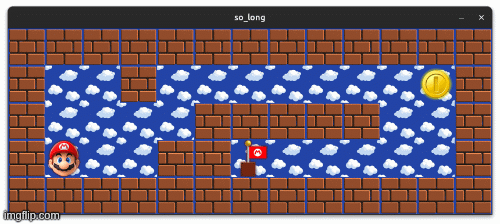

# So Long - 42 School Project




## 🎮 Introduction

**So Long** is a simple 2D game developed as part of the 42 School curriculum. The objective is to guide the player character through a map, collecting all the items (collectibles) and reaching the exit. The project focuses on working with the MiniLibX graphics library, handling window management, events, and basic game logic in C.

## ✨ Features

-   **2D Graphics:** Renders a tile-based map using textures.
-   **Map Parsing:** Reads map layouts from `.ber` files.
-   **Map Validation:** Ensures the map is rectangular, surrounded by walls, and has a valid path to the exit.
-   **Player Movement:** Smooth movement controls using keyboard inputs.
-   **Game Logic:**
    -   Collect all coins (`C`) to unlock the exit (`E`).
    -   Track and display the number of moves in the terminal.
    -   Win condition upon reaching the exit after collecting all items.
-   **Event Handling:** Supports window closing and `ESC` key to exit cleanly.

## 🛠️ Installation & Compilation

To compile the project, you need to have `make` and a C compiler (like `cc` or `gcc`) installed. The project uses **MiniLibX**, which requires standard X11 libraries on Linux.

1.  **Clone the repository:**
    ```bash
    git clone git@github.com:sdadak42/So_Long.git
    cd So_Long
    ```

2.  **Compile the game:**
    Run the following command in the root directory:
    ```bash
    make
    ```
    This will compile the `Libft` library, `ft_printf`, `MiniLibX`, and the game source files, producing the `so_long` executable.

3.  **Clean up object files (optional):**
    ```bash
    make clean
    ```

4.  **Full cleanup (removes executable):**
    ```bash
    make fclean
    ```

## 🚀 Usage

Run the game by providing a valid map file as an argument:

```bash
./so_long maps/example.ber
```

*(Note: If you don't have a `maps` folder, you can use any valid `.ber` file, e.g., `./so_long deneme.ber`)*

### 🗺️ Map Format (`.ber`)

The map file must be a rectangular grid using the following characters:
-   `1`: Wall
-   `0`: Empty space (Floor)
-   `P`: Player starting position
-   `C`: Collectible (Coin)
-   `E`: Exit

**Example Map:**
```text
1111111111111
10010000000C1
1000011111001
1P0011E000001
1111111111111
```

## 🎮 Controls

| Key | Action |
| :---: | :--- |
| **W** | Move Up |
| **A** | Move Left |
| **S** | Move Down |
| **D** | Move Right |
| **ESC** | Close Game |

## 📂 Project Structure

-   `so_long.c`: Main entry point and game loop.
-   `map_read.c`: Handles reading the map file and memory allocation.
-   `map_check.c`: Validates map rules (walls, rectangular shape, characters).
-   `is_accessible.c`: Verifies that a valid path exists from Player to Exit and Collectibles.
-   `utils.c`: Helper functions for error handling and cleanup.
-   `Libft/`: Custom C library containing standard functions.
-   `minilibx-linux/`: Graphics library for window and image management.

## ⚠️ Error Handling

The program includes robust error checking for:
-   Invalid arguments.
-   Non-existent or unreadable files.
-   Invalid map configurations (missing walls, duplicate players, unreachable areas).
-   Memory allocation failures.

If an error occurs, the program prints `Error` followed by a descriptive message and exits cleanly.

---
*Developed by sdadak for 42 Istanbul.*
